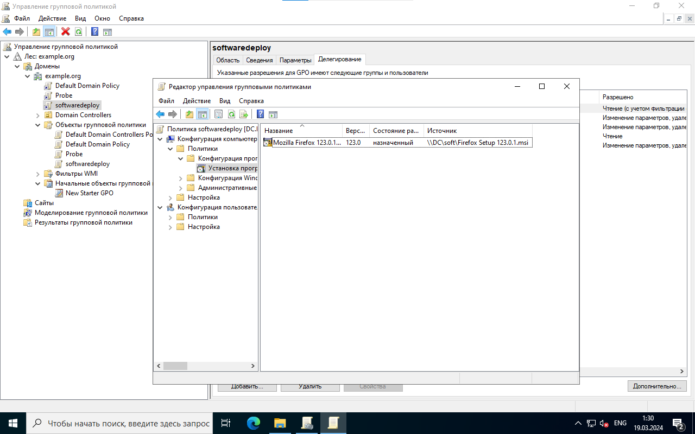

## объект групповой политики Probe, который:

применяется для пользователей user2, user3 

удаляет закреплённые программы с панели задач
удаляет закреплённые программы с панели задач

отключает приложение Store (компоненты «Windows Магазин»)

## установка на клиентской машине приложение из пакета MSI

## Публичный пакет, который пользователь может установить самостоятельно

## Установите и настройте службу WSUS на сервере и групповые политики клиента на получение обновлений с сервера WSUS.

